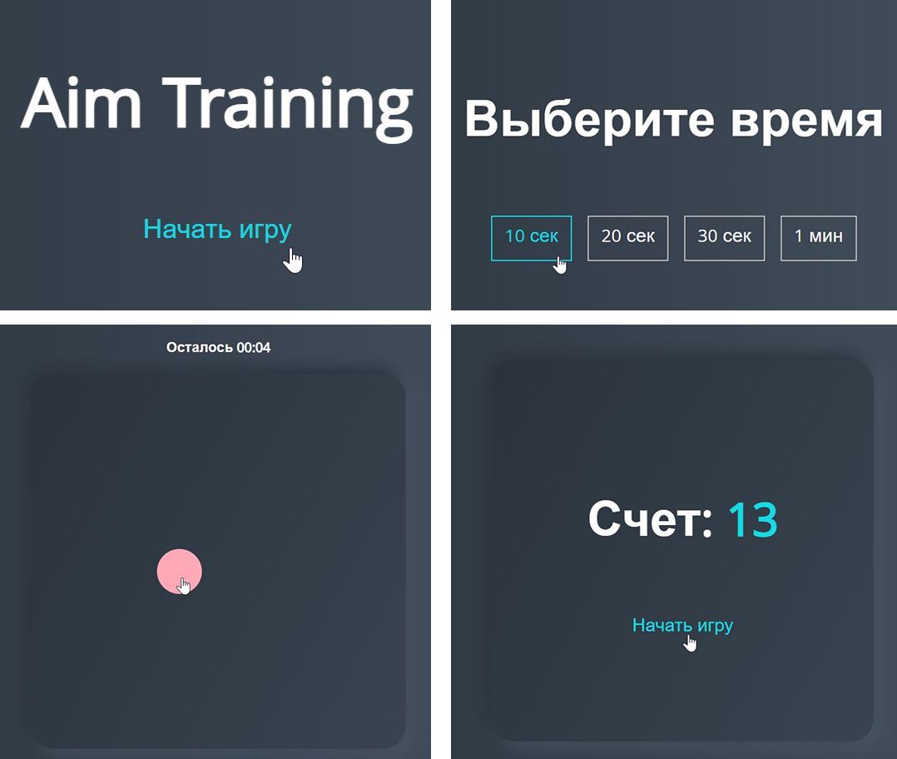

## Доска для рисования

### Цель игры:

Набрать наибольшее количество попаданий по кругам за выбранное время.

### Функционал: 

- Динамическая генерация и стилизация контента

- Работа таймера, обработка таймаута

- Рандомный выбор цвета, размера, местоположения кругов

- Возврат игры к начальным значениям

- Опубликовано на GitHub Pages